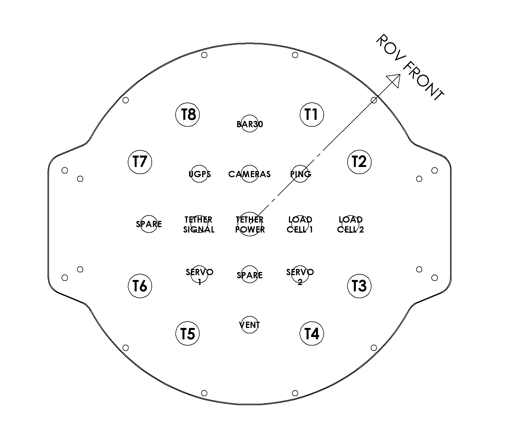
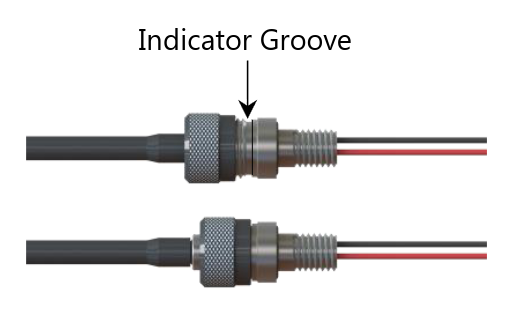

### Safety
- E-Stop: Control box has two switches, one for power and a direct e-stop switch for the motors. Do not release the e-stop until the rov is in the water, or during bring-up testing.
- Temperature: Control box has a clear lid, in direct sunlight it will get very warm inside, keep it in in the shade! ROV main enclosure will also get hot if left in sunlight for too long, try not to leave it in the sun either.
- ROV Arm/Disarm: ROV status is displayed on a light bar in the camera enclosure, status is displayed using the [standard ardupilot signals](https://ardupilot.org/copter/docs/common-leds-pixhawk.html). Essentially anything besides blue or green means there is a system failure, some examples are below:
	- Disarmed: blinking led
		- Yellow: pre-arm checks failing
		- Green: good gps fix
		- Blue: no gps fix
	- Armed: solid led
		- Green: good gps fix
		- Blue: no gps fix

### Checklist
- [ ] Charged batteries
	- [ ] 1x 16000 mAh 6S for ground station
	- [ ] 4x 10000 mAh 6S for spydra
- [ ] Steam deck with QGC OR laptop with controller
- [ ] Vacuum pump with gauge and blue robotics backfill adapter
- [ ] Gopro kit
- [ ] Tether spool
- [ ] Control box
- [ ] ROV

### Setup

#### Connectors

!> Cobalt connectors must be screwed in all the way (covering the indicator groove) for them to seal, see image below for correct installation:
 

### Operation

!> QGC only saves logs on vehicle disconnect! Make sure to turn off the ROV before quitting QGC. To prevent losing logs, SpydraQGroundControl is patched to save log temporary files to `~/qgc_temp/` instead of the system temp directory and not to delete temporary logfiles. The file name won't have the date and time, but you can look at the file creation date to recover lost log files. QGC tries to automatically recover lost logfiles, but it is inconsistent in practice.

#### Buttons

#### Control Modes
- Manual: Fully manual, direct passthrough from joystick to mixer.
- Stabilize: Ardusub attitude stability controller.
- Anchoring: Custom anchoring control mode, tries to keep rov at a certain world-frame angle while spinning around Z to screw in anchors. For now, angle is hard-coded in as vertical but will be a settable parameter soon. See `ardupilot/libraries/AC_AnchorControl/` for details.

!> Only turn on anchoring mode while the tip of the anchor is already touching the seabed! While ungrounded, the rov can't control the angle, and will run out of control. There are no safeguards to prevent this happening besides the e-stop.
